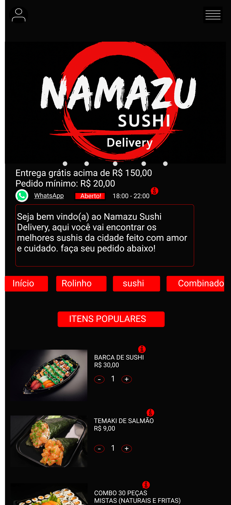
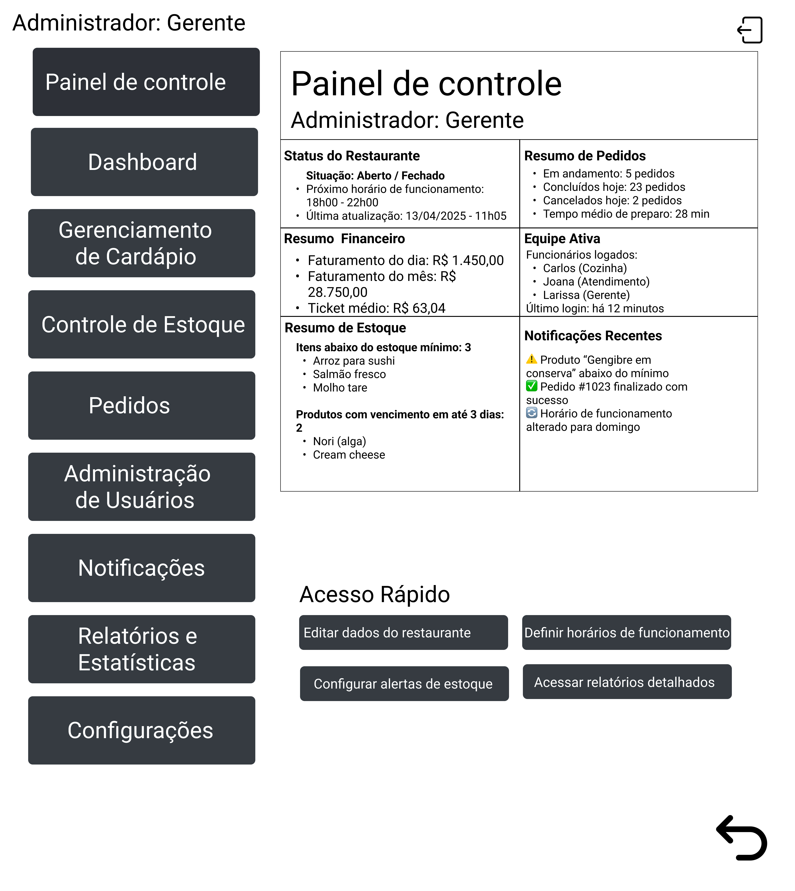
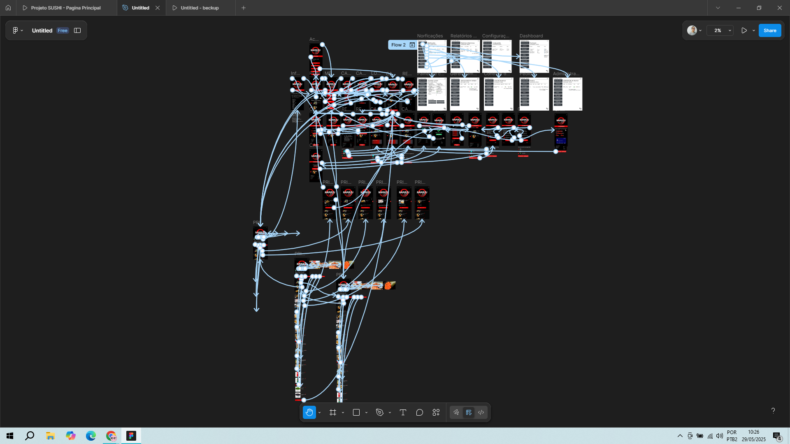

# Figma-Namazu# 🍔 Sistema de Delivery com Painel Administrativo

Este projeto tem como objetivo oferecer uma solução completa para restaurantes e lanchonetes realizarem vendas online por meio de um **site de delivery** integrado a um **painel administrativo**, facilitando o gerenciamento de pedidos, produtos, estoque e clientes.

## 🖼️ Ilustrações do Projeto

> Abaixo estão algumas imagens que demonstram o funcionamento visual do sistema:

📷 **Imagem 1:** Tela inicial do site de delivery para o cliente.  
📷 **Imagem 2:** Painel administrativo com menu lateral (dashboard, pedidos, estoque, etc).  
📷 **Imagem 3:** Todas as telas mostrando as ligações entre as páginas 

## 🧩 Funcionalidades

### 🎯 Área Administrativa
- 📊 **Dashboard** com resumo de pedidos, faturamento e alertas.
- 📋 **Gerenciamento de Cardápio** com cadastro, edição e exclusão de produtos.
- 📦 **Controle de Estoque** com alertas automáticos e relatórios.
- 🧾 **Pedidos** com acompanhamento em tempo real e histórico com filtros.
- 👤 **Gestão de Usuários** com níveis de permissão (cozinha, atendimento, gerência).
- 🔔 **Notificações** internas e externas (clientes).
- 📊 **Relatórios** de vendas, produtos mais pedidos e consumo de insumos.
- ⚙️ **Configurações gerais** do sistema e do restaurante.

### 🛒 Área do Cliente
- Visualização do cardápio com categorias.
- Escolha de produtos, personalização e envio de pedidos.
- Acompanhamento do status do pedido.
- Responsividade (acessível por celular, tablet e desktop).

---

## 🛠️ Tecnologias Utilizadas

- 🎨 **Figma** – Protótipos de alta fidelidade
- 🧠 **Levantamento de Requisitos** – Funcionalidades mapeadas com base em fluxos reais de atendimento
- (Outras tecnologias podem ser adicionadas conforme implementação: HTML, CSS, JS, backend etc.)

---

## 📂 Organização do Projeto

